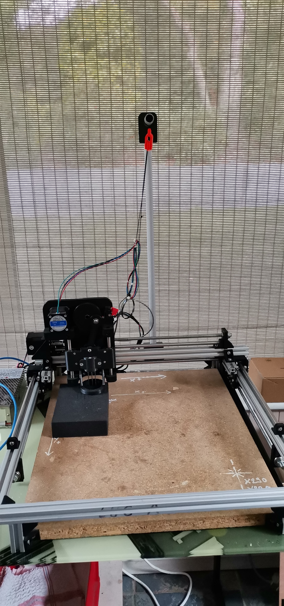

<!--# Feutrage de laine -->
<!--+ 2021-2022 -->
<!--$ Python-->
<!--$ Freecad-->
<!--% Un projet pour une machine à feutrer la laine, activité fastidieuse et dangereuse -->

# Feutrage-de-laine


Un projet pour une machine à feutrer la laine, activité fastidieuse et dangereuse



## Installations Outils Python3.10

Le code est exécuté avec Python3 et les bibliothèques PyQt5

```
sudo apt install python-pip
sudo apt-get install python-qt5
sudo apt-get install pyqt4-dev-tools 
pip install pyserial
sudo apt-get install qt4-designer
```

## Conversion de l'interface UI en code Python

Cette commande est à réaliser à chaque modification de l'interface graphique (éditée via QtCreator)
```
pyuic4 -x GUI.ui -o GUI.py
```


Le dossier V4_GUI_PyQt4 contient le code source pour l'Interface PyQt4


## Lancement de l'interface

```
python3 GUIMain.py
```
